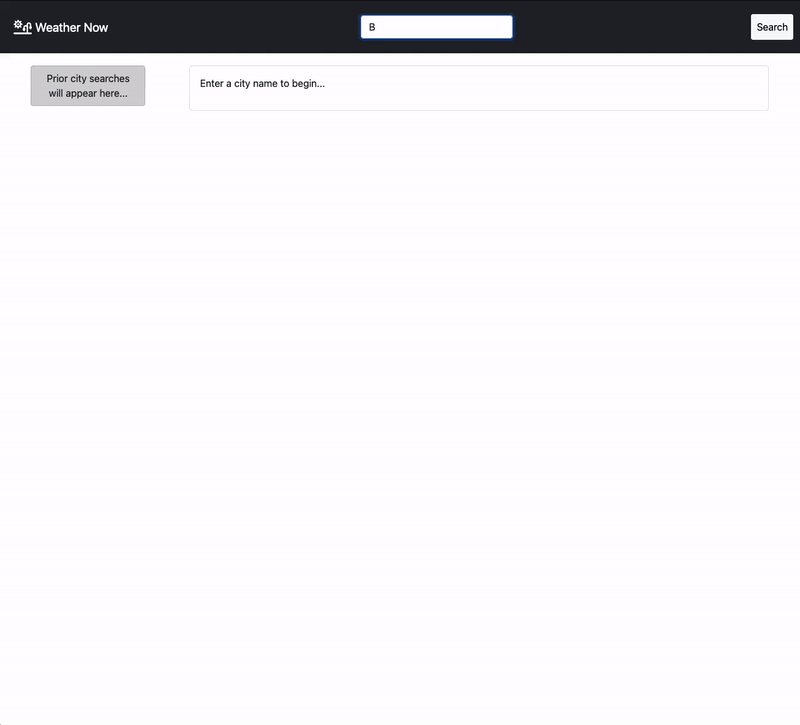
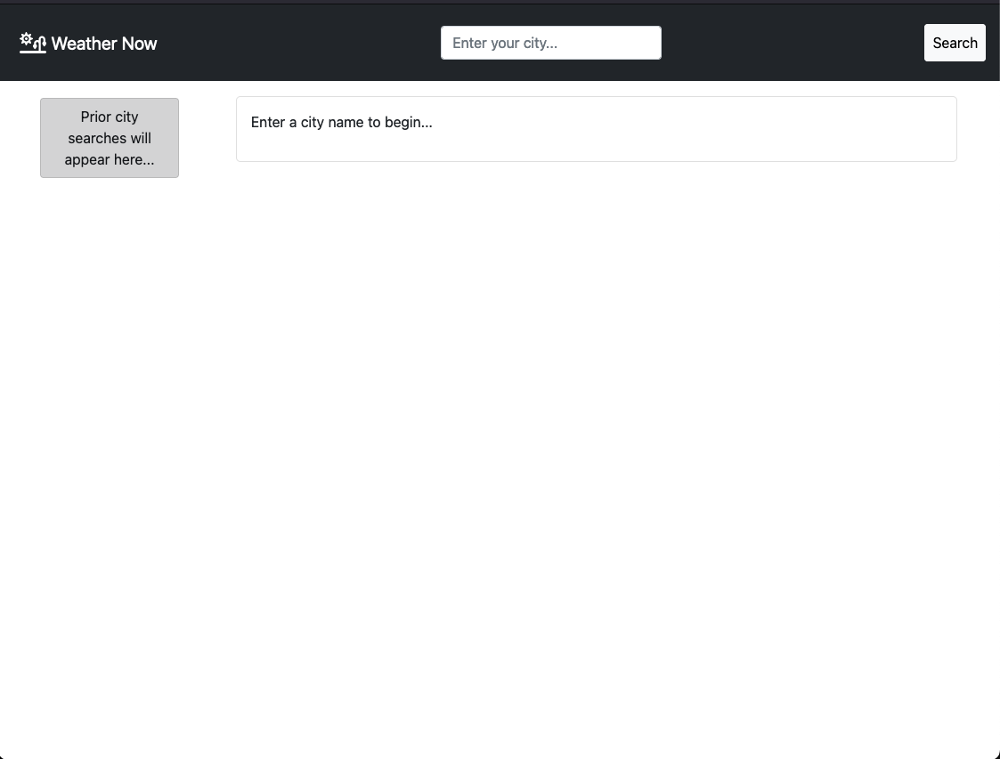
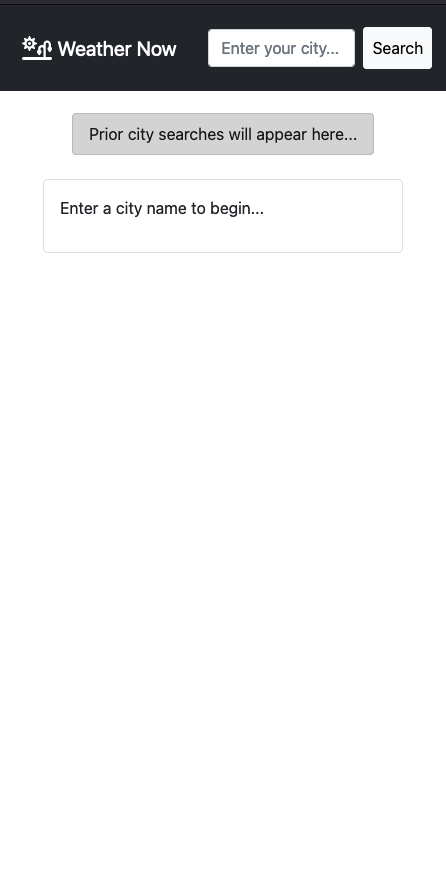
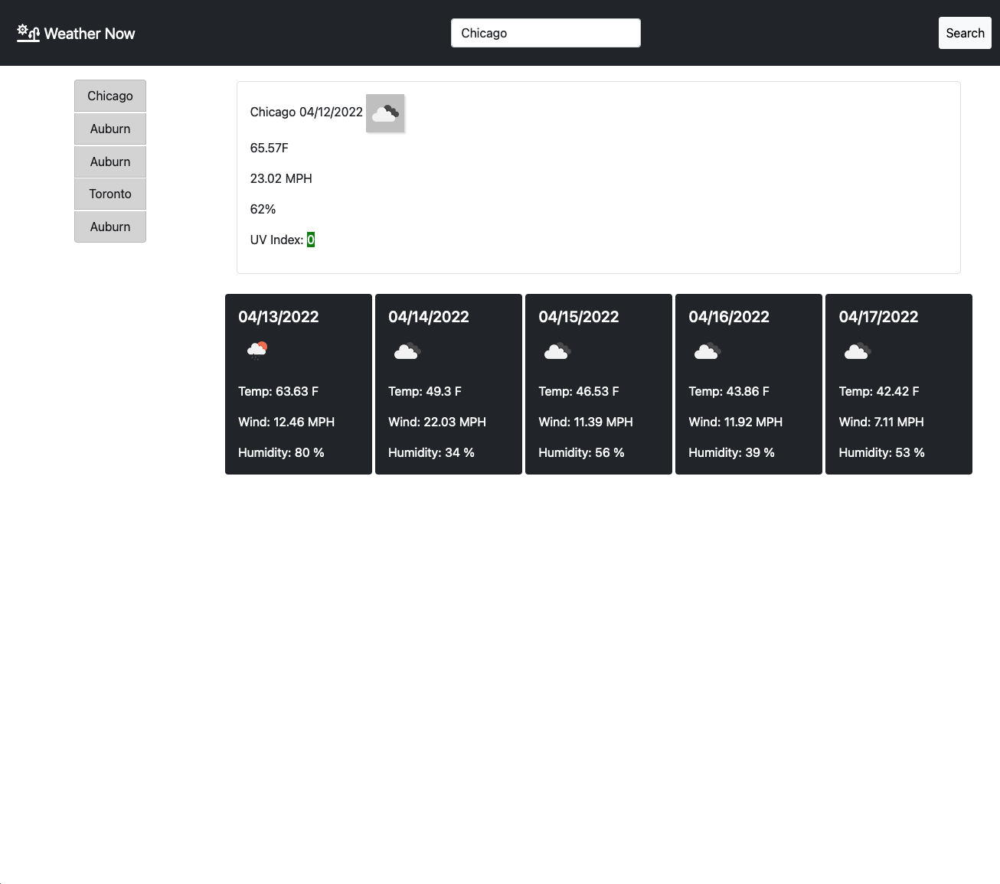

# wheresmyweather
as a user I want to see the weather outlook for multiple cities so that I can take personal measures to plan my time appropriately

## Description

This repository contains a weather dashboard that allows a user to see the current weather and future outlook for a given city of interest. The application uses local storage to make it easy to revisit the five most recent searches.

## Technologies
- HTML5
- CSS3
- Bootstrap
- Vanilla JS
- jQuery

## Third Party APIs
- [Open Weather  Geocoding API](https://openweathermap.org/api/geocoding-api)
- [Open Weather One Call API 1.0](https://openweathermap.org/api/one-call-api)
- [Open Weather  5 day weather forecast API](https://openweathermap.org/forecast5)

## Live Application
See it [live!](https://mcjbyday.github.io/wheresmyweather/)

    
## Screenshots
| Image | Description |
| --- | ----------- | 
|  | Live use of the application |
|  | First Time User Experience|
|  | Mobile |
|  | Weather Content Snapshot |

## Other

No external installations are required to view this website. 

## Roadmap

- [x] Allow one click of past search items to result in a search
- [ ] Improve UVI color contrast for readability
- [ ] Consolidate API calls for more efficient fetching

## Contact
Comments or questions?  
Author: Michael Jacobs  
Email: jacobsmichaelc@gmail.com  
GitHub: [https://github.com/mcjbyday](https://github.com/mcjbyday)  